# Fungible_Token_ERC20
## Project Description
 This soilidity project sets up a new cryptocurrency, named KaseiCoin. It is a fungible token that’s ERC-20 compliant. A crowdsale is launched and it allows people to convert currency to KaseiCoin.

 

## Contents
The project includes the following:
* A fungible token Solidity contract that’s ERC-20 compliant 
* A crowdsale contract from the Solidity library that manages the entire crowdsale process. It allows users to send Ether to the contract and receive KAI, or KaseiCoin tokens, in return. 

The contract automatically mints the tokens and distribute them to buyers in a single transaction.

Either a short video or a set of screenshots that illustrates your work for each subsection of the Challenge. You should place this in the Evaluation Evidence section of the README.md file in your GitHub repository for this Challenge.

## Execution Steps
1. Compile KaseiCoin Token Contract using version 0.5.5 of the compiler.
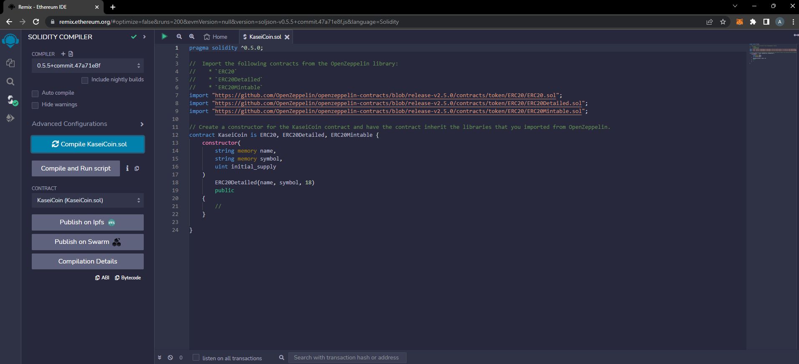

2. Compile KaseiCoin CrowdSale Contract using version 0.5.5 of the compiler.
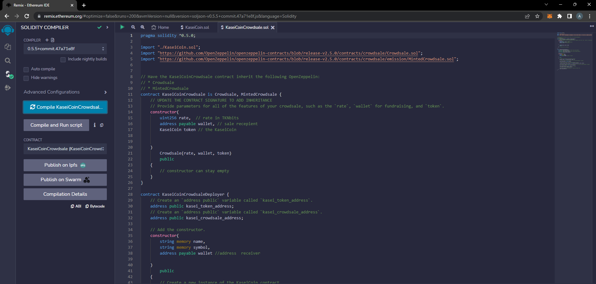

3. Deploy KaseiCoin CrowdSale Contract Deployer from an Etherium wallet as shown below:
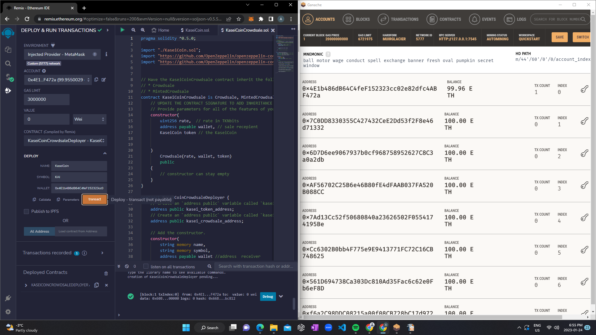

4. Deploy KaseiCoin and CrowdSale Contracts using addresses generated by deployer as shown below:
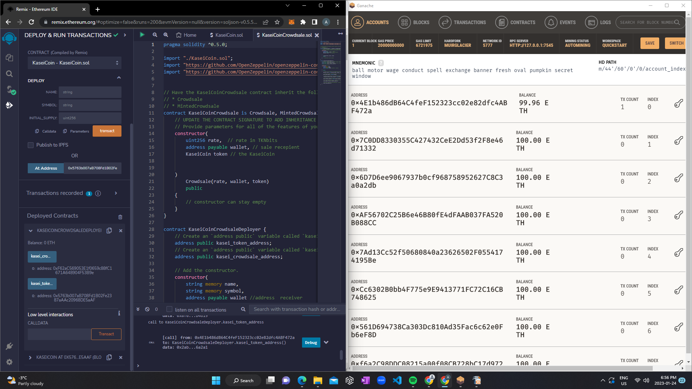

5. Test purchasing Kasei from a different wallet as shown below:
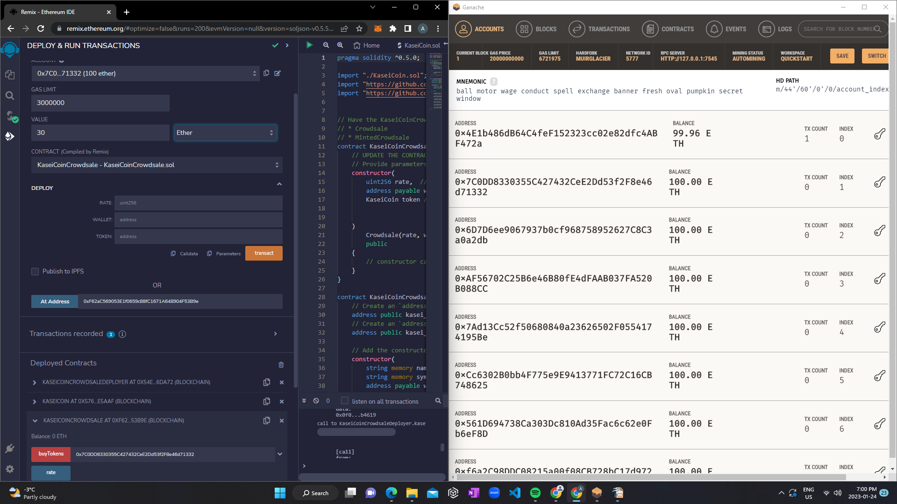

6. The updated wallet, crowdsale, and token balance should be as follows:
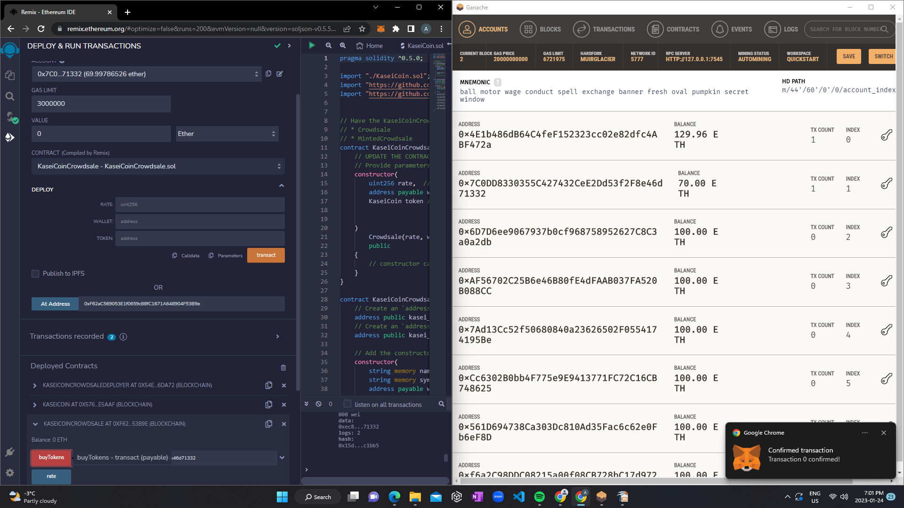
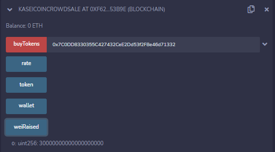
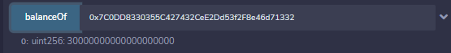

5. Repeat the purchase test from a different wallet as shown below:
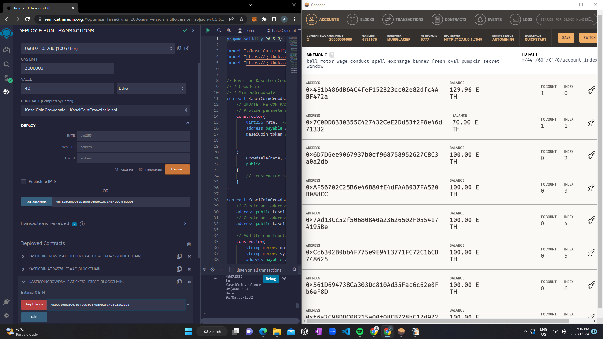

6. The updated wallet, crowdsale, and token balance should be as follows:
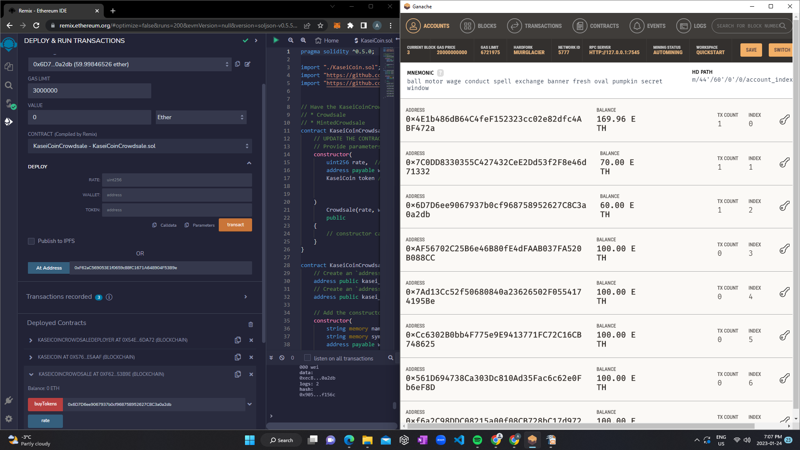
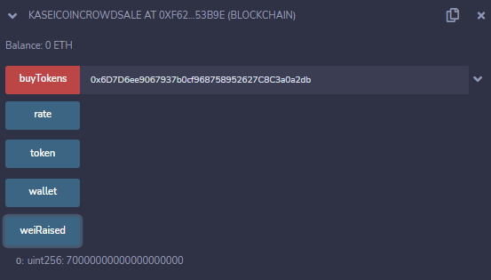
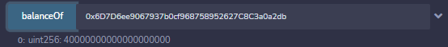

**Notice that the tests above have an unlimited crowdsale amount and time**

As shown in the figures below, the Solidity CrowdSale contract included have been updated by using the following OpenZeppelin contracts:

* **CappedCrowdsale**: Allowing to cap the total amount of Ether the crowdsale can raise

* **TimedCrowdsale**: Allowing to set a time limit for the crowdsale by adding an opening time and a closing time

* **RefundablePostDeliveryCrowdsale**: Adds the capability of refunding investors to the crowdsale

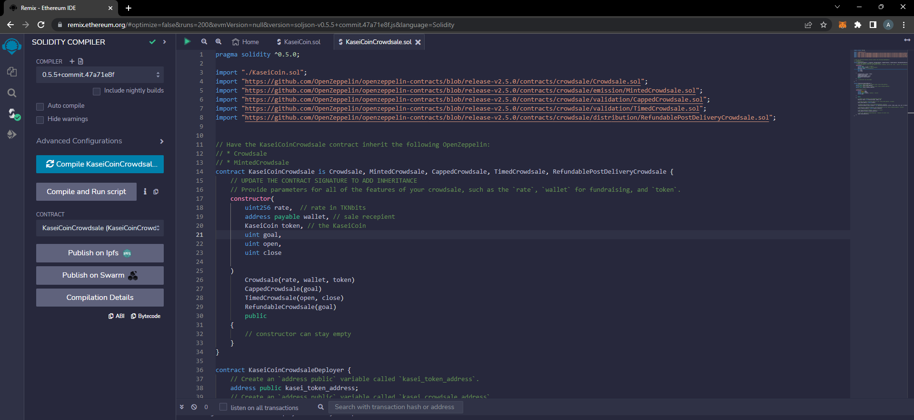

7. Deploy KaseiCoin CrowdSale Contract Deployer from an Etherium wallet setting a token cap (300,000,000,000,000,000 wei in this case) as shown below:
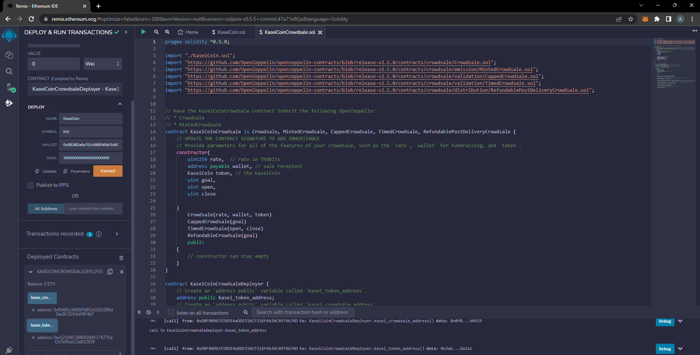

8. Deploy KaseiCoin and CrowdSale Contracts using addresses generated by deployer as shown below:
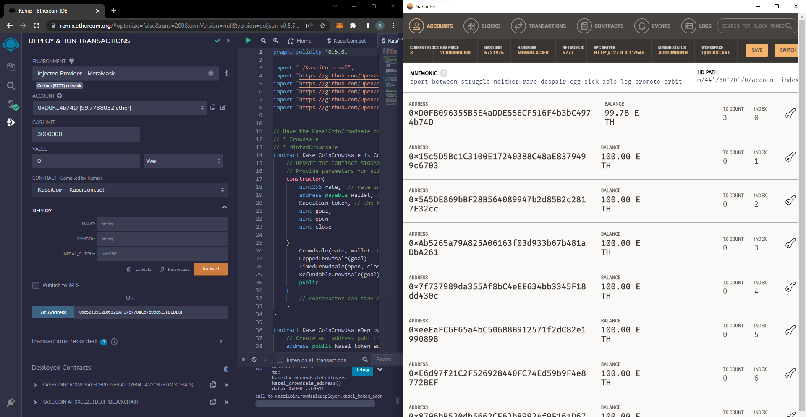
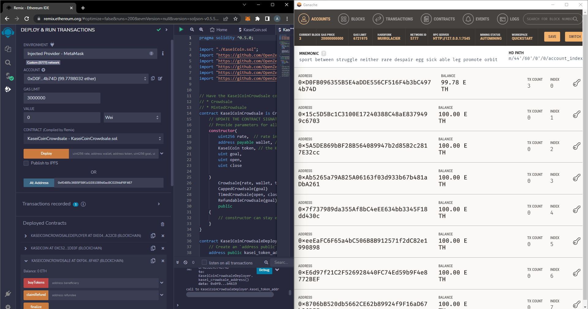

9. Test purchasing Kasei from different wallets as shown below to attempt to reach the cap:
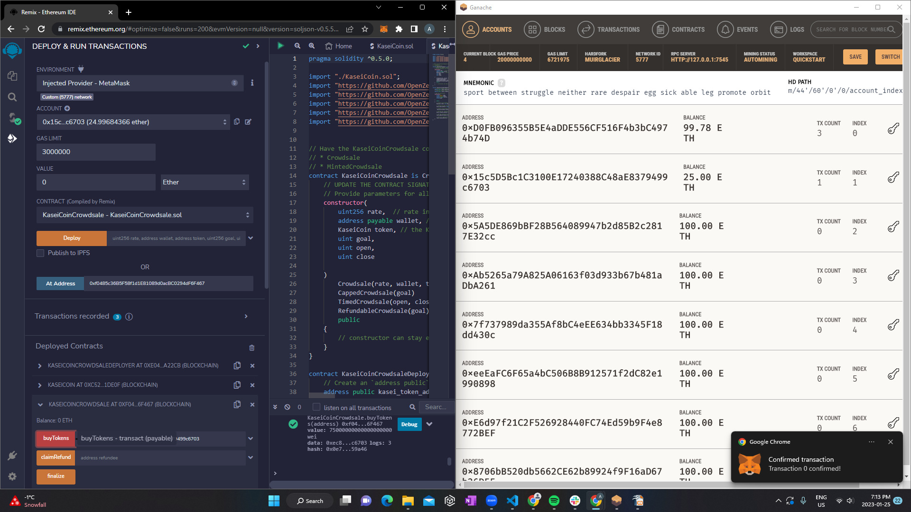

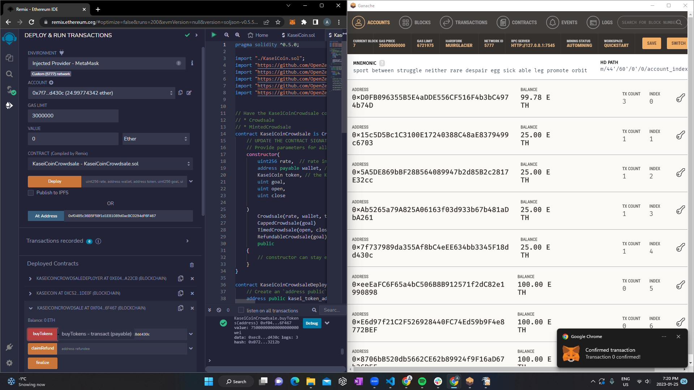

As shown above, the last purchase failed. This is because the CrowdSale cap has been reached (see below).

10. To test the time limit of the CrowdSale, the expiry time time is set to 10 minutes after deployment (see below).

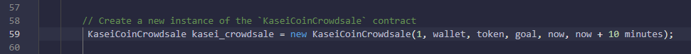

11. The contracts are deployed as before (see below):
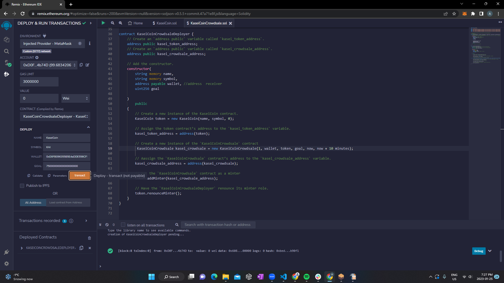

12. Kasei purchase is tested while the CrowdSale is live from different wallets as shown below:
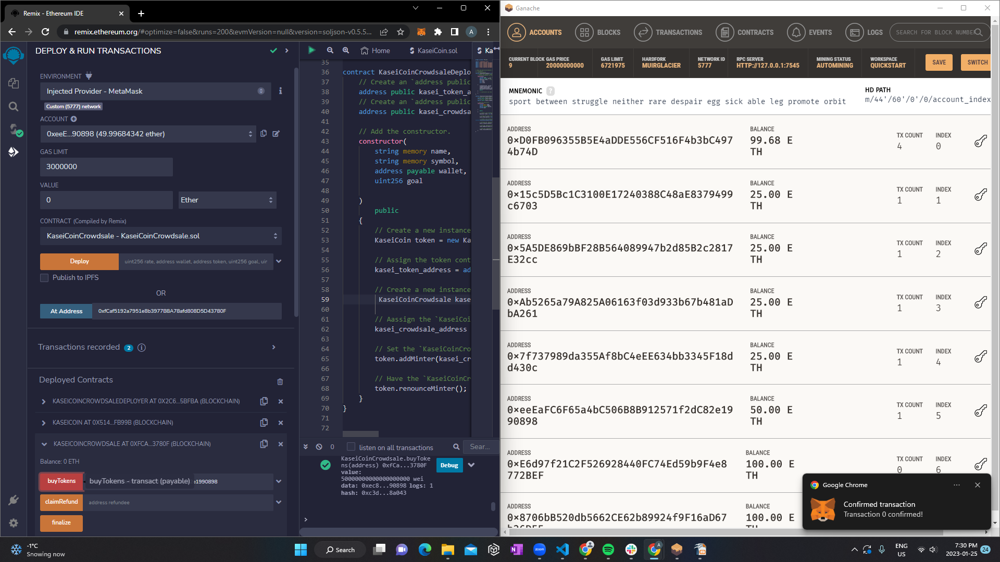

12. A Kasei purchase is attempted after the CrowdSale is closed, resulting in an error as shown below:
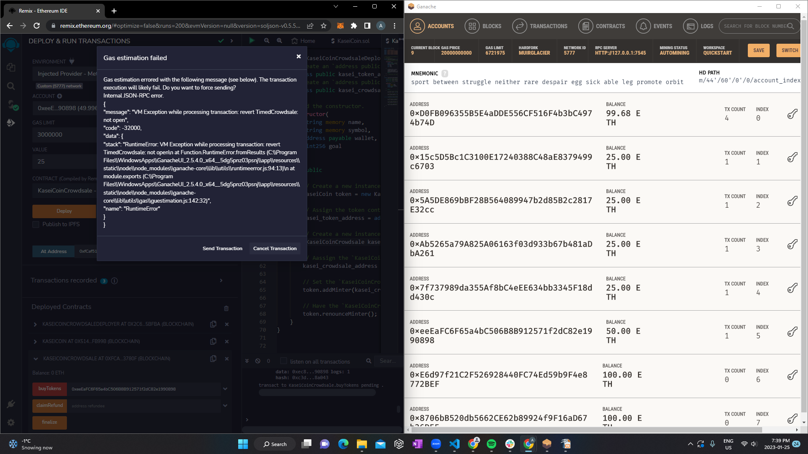

# Software Employed
* **Remix IDE** was used to interact with Etherium blockchain. it is a no-setup tool with a GUI for developing smart contracts. Used by experts and beginners alike, Remix will get you going in double time. Remix plays well with other tools, and allows for a simple deployment process to the chain of your choice. Remix is famous for our visual debugger. Remix is the place everyone comes to learn Ethereum. https://remix-project.org/

* **MetaMask** was used to store and manage accounts.  MetaMask provides the simplest yet most secure way to connect to blockchain-based applications. You are always in control when interacting on the new decentralized web. https://metamask.io/

* **Ganache** was used to set up the test Ethereum blockchain.  Ganache is a personal blockchain for rapid Ethereum and Corda distributed application development. You can use Ganache across the entire development cycle; enabling you to develop, deploy, and test your dApps in a safe and deterministic environment. https://trufflesuite.com/docs/ganache/ 

